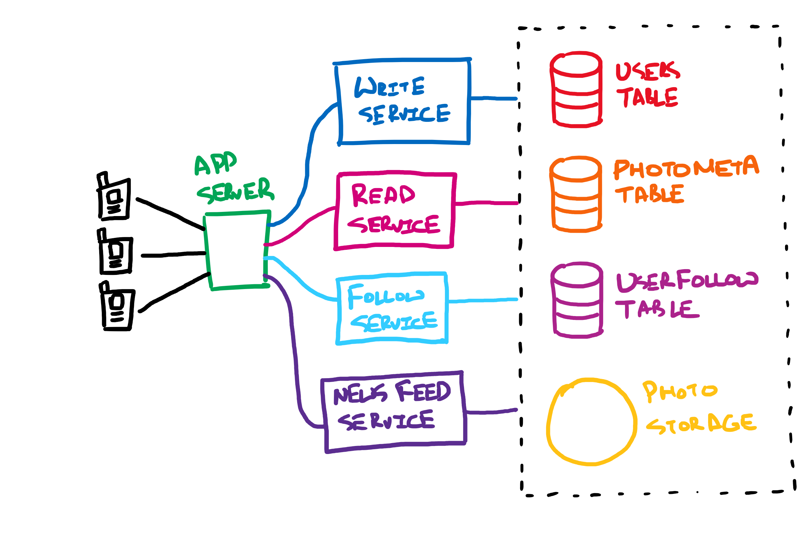
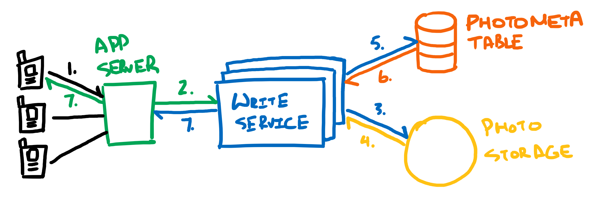
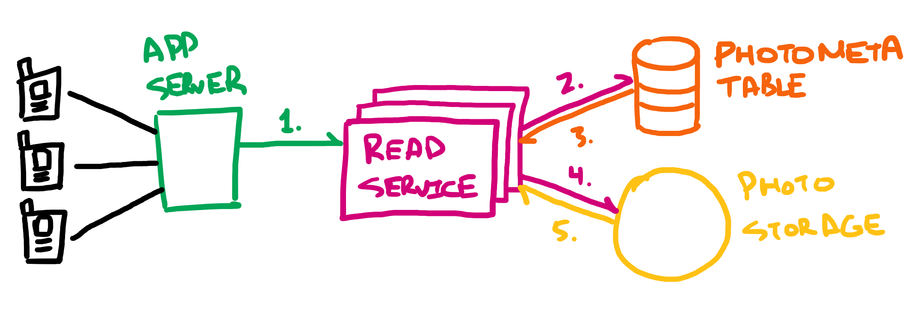
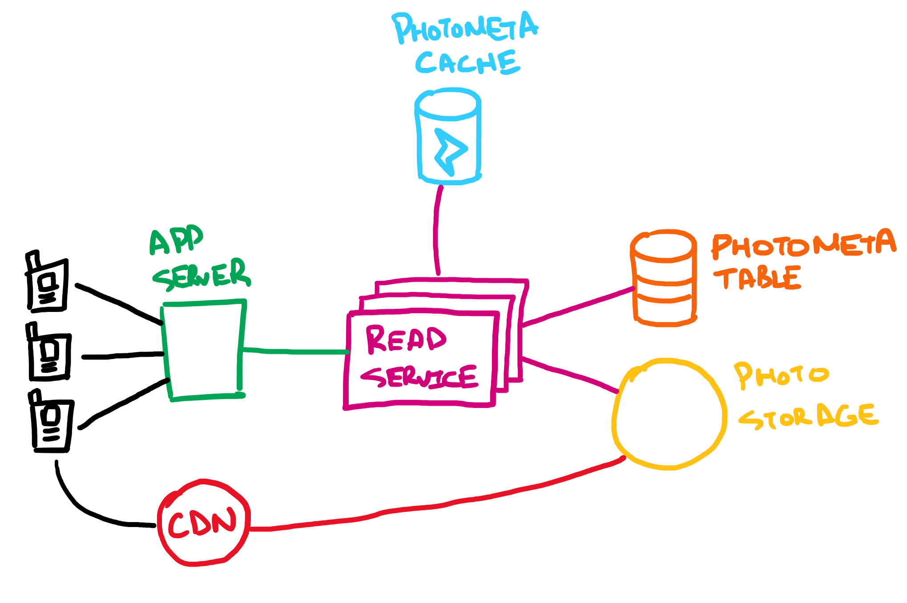
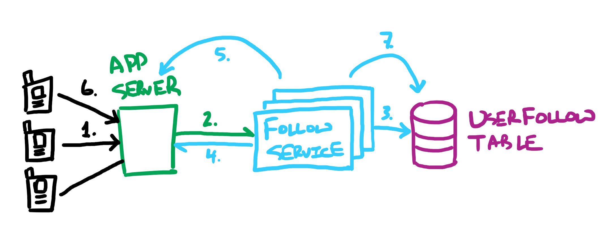

This article breaks down how to approach a system design problem through the example of designing an Instagram-like application. It is by no means comprehensive, and is meant to be an example of how someone might approach the design of *parts* of a complex system when there is a time constraint, such as during an interview.

# Requirements

Our first job will be to limit the scope of requirements for the design. Let's tackle only the following features for our simplified version of Instagram:
- Photo Sharing
- Followers
- News Feed

After asking some clarifying questions, we arrive at the following requirements list:

**Functional Requirements**
* Users should be able to upload/download/view photos
* Users can follow other users
* The News Feed should show top content from all people a user follows

**Non-Functional Requirements**
* System should be highly available. Once a user uploads/updates content, it is acceptable for there to be a lag until the upload/update is seen.
* System should be highly reliable. Once a user uploads content, it should not be lost.
* News feed generation latency must be no more than 200ms
* Read-heavy system. For example, a typical user scrolls through way more photos in the feed than he/she uploads.

**Out of Scope**

And just to be extra clear, let's list what will **not** be covered in the design.

* Comments
* Tags
* Likes
* Stories
* Filters/Image-Processing

# Estimates

We'll want some rough back-of-the-envelope calculations to inform our design decisions going forward. Some of the following questions come to mind:

* How many active users are expected per day?
* How many photos will be uploaded per day?
* What is the ratio of reads to writes in this system?
* What is the average size of uploaded photos?

For the above questions, let's assume the following:

| **Parameter** | **Estimate** | **Notes** |
| --- | --- | --- |
| Number Active Users Per Day | 500 million | - |
| Number Photos Uploaded Per Day | 100 million | Assume that the average user creates 1 new post every 5 days |
| Ratio Writes to Reads | 1:50 | Assume much more reads than writes. This makes sense, as most users will scroll through more photos in their feed than they upload. If the average user views 10 images per day, then over 5 days this will be 50 images. |
| Average size of uploaded photos | 5 MB | - |

At 100 million uploads per day and an average size of 5 MB per upload, we would have 500 terabytes per day. In one year, we would have 182.5 petabytes of data.

Estimating in the opposite direction, we would need to satisfy the following request rates:

| Calculated Value | Estimate |
| --- | --- |
| Write requests per second | 100 million / (24 x 3600) ~= 1,200 |
| Read requests per second | 1200 x 50 = 60,000 |

# Data Model 

**Database Type**

The first solution that comes to mind is some sort of RDBMS, such as MySQL, as we will probably need join-like operations between different tables (ex. joins between a users table and photo metadata table to know which photos belong to a particular user). 

However, because it is expected that each of our system's tables will expand to a very large size, and because scaling a SQL solution to such a size is problematic, we will use a NoSQL solution. Given the nature of our system, a distributed key-value store such as Cassandra may be appropriate.

Usage of a NoSQL database has the advantage of allowing us to handle the expected request volume of the application. We can more easily partition the data and distribute it among many load-balanced database servers if needed. On the flip-side, it has the disadvantage of missing the ACID features of a SQL solution; we will have to implement this functionality ourselves if requirements demand it.

**Relation Schemas**

We will need database tables for user information, photo metadata, and the many-to-many associative relationship between followers and followees. The relation schema for each table is as follows:

| **Users Table** | |
|---|---|
| PK | UserID: int |
| | Name: varchar(20) <br> Email: varchar(40) <br> DateOfBirth: datetime <br> CreationDate: datetime <br> LastLogin: datetime <br>  |

The **Users Table** is for holding details about a user. Note we will need the `LastLogin` column for determining recent content to show to a user for the News Feed feature.

| **PhotoMeta Table** | |
|---|---|
| PK | PhotoID: int |
| | UserID: int <br> FilePath: varchar(256) <br> Caption: varchar(500) <br> PhotoLatitude: int <br> PhotoLongitude: int <br> UserLatitude: int <br> UserLongitude: int <br> CreationDate: datetime <br> |

The **PhotoMeta Table** contains metadata about stored photos. Since the relationship between users and photos is an unbound one-to-many relationship, we've included the `UserID` on this table. 

An index could be built on the `UserID` column if we want to easily query photos by user. Alternatively, implementation of a multi-column/composite index on `UserID` and `CreationDate` could be considered for the news feed feature (more on this in the News Feed section below).

| **UserFollow Table** | |
|---|---|
| PK | FollowerID: int <br> FolloweeID: int |
| | Approved: boolean |

The **UserFollow Table** is an associative collection that is required to satisfy the unbound many-to-many relationship between followers and followees. The primary key here will be a compound key of the `FollowerID` and `FolloweeID` columns. An `Approved` flag has been provided to indicate whether the follow has been approved by the followee.

**Photo Storage**

The expected large volume of photos would necessitate the usage of a distributed file system such as HDFS or S3.

# High-Level Design

At a high-level (i.e. omitting caches, load balancers, replicas, and message brokers), our application will have the following components:

1. Write service
2. Read service
3. Follow service
4. NewsFeed service
5. Users table
6. PhotoMeta table
7. UserFollow table
8. Photo storage


*Figure 1: High-Level System Overview*

# Detailed Design

Let's go ahead, pick a few components of our system, and drill in a bit deeper.

### Feature: Reading and Writing


*Figure 2: Write Service*

Steps for uploading a photo:

1. User makes a request with photo to upload
2. Request is forwarded to an instance of the **Write Service**
3. **Write Service** sends the photo to **Photo Storage**
4. On image storage success, the image storage solution responds with a success response and the location of the file in **Photo Storage**
5. **Write Service** creates a corresponding entry for the photo in the **PhotoMeta Table**
6. On entry creation success, a success response is sent back to **Write Service**
7. A success response is sent back to the client via the **App Server**


*Figure 3: Read Service*

Steps for viewing a photo:

1. A request to view a photo with a certain `PhotoID` is made. This request is forwarded to an instance of **Read Service**
2. **Read Service** takes the `PhotoID`, and requests metadata from the **PhotoMeta Table**
3. The metadata is returned  
4. **Read Service** takes the `FilePath` from this metadata, and requests the photo from image storage
5. The photo is returned from image storage, at which point **Read Service** may request more photos, or send the requested photo to the user.

**Read and write services have been separated. Why?** 

This is because of two reasons:

* There is a large read to write ratio
* Writes are slow, while reads are fast

Because writes take up server connections while uploading occurs, we do not want times of high writes to affect read volumes. It is also possible to have a problem the other way; read volume could be so high at some point in time that it affects write volumes. 

To mitigate these issues, read and write have been implemented as separate services, with each service on separate dedicated servers. This allows scaling and optimization of writes and reads to occur independently.

#### Caching

The high read volume gives us an excellent opportunity to implement one or more caches for improving read performance. We can cache entries that the **Read Service** retrieves from **PhotoMeta Table**, as-well-as photos retrieved from **Photo Storage**.

Since **Read Service** is expected to be a scaled service with multiple instances, a global cache could be used for caching recently requested **PhotoMeta Table** values. In addition, we could have a CDN for caching photos at geographically closer locations to requesting users.


*Figure 4: Read Service With Caching*

**What should be the cache invalidation scheme?**

Our service has the following characteristics/requirements:
* Read-heavy. The typical user views more photos than he/she uploads.
* Reliable. Photos that are uploaded should not be lost.
* Skewed request loads. Photos from popular users will be requested in high volume, while those from unpopular users will not.
* No photo editing support. Instagram does not allow a user to edit anything other than a post's metadata after creation; we will do the same.

For the **PhotoMeta Cache**, we do not want a write-through cache, as photo metadata could potentially be written but never retrieved again, such as for unpopular photos. We also do not want a write-around cache, as our system has a reliability requirement; storing metadata in cache first could lead to lost data if the cache server(s) ever crash before the data is written to database. 

That leaves a write-around cache invalidation scheme, one where uploading a photo will bypass the cache and write directly to database. While the initial request of photo metadata will result in a cache miss, subsequent requests will grab the metadata from cache (at least until it is evicted).

For much the same reasons, the CDN should be a pull type CDN, only caching data that has been requested.

**How much data should be cached?**

For the amount of data, we can defer to the 80:20 principle. For instance, we can estimate/measure the total size of photo metadata requested daily, and make each cache's maximum capacity equal to 20% of that. Fine tuning can occur as we get more real-world usage statistics. 

**What should be the cache eviction policy, such as when a cache becomes full and new data is available to cache?**

A least-recently-used scheme seems reasonable. We can simply evict metadata that has not been requested as frequently as other metadata.

### Feature: Followers

The requirements for this section need further clarication. To extend on the high level goals, we are aiming for the following:
- A user (the follower) should be able to request to follow another user (the followee)
- The followee should be able to approve or deny this request at any time after the request is made
- Until the followee either denies or accepts the follow request, the follower's client will show the text 'Requesting' in place of the 'Follow' button beside the pending followee's name
- If a followee denies the request, the follower's client will revert the 'Requesting' back to the 'Follow' button with no notification
- If a followee approves the request, then the follower-followee relationship will be confirmed, and the follower will have access to the followee's non-public profile. No notification will be sent for this case as well.


*Figure 5: Follow Service*

Steps for a follow request that is approved:
1. User requests to follow another user
2. Request gets forwarded to an instance of **Follow Service**
3. **Follow Service** creates an entry in the **UserFollow Table** for the new follow relationship with the `Approved` flag set to **false**.
4. On success, **Follow Service** notifies the client, such that the client can show the aforementioned 'Requesting' text. 
5. **Follow Service** sends an alert to the followee through an instance of **App Server**
6. Followee approves the new follower which sends confirmation back to **Follow Service**
7. **Follow Service** updates the entry created in step 3 with a value of `true` for the `Approved` column.

At any later time, the follower comes online, and grabs the updated **UserFollow Table** data specific to him/her.

**Why do we need to create the not-yet-approved entry in step 3?**

If the user was only using one device to access Instagram, then allowing client-side caching of pending follow requests would be ok. However, the user could always access his/her account using another device. We need one universal source of truth for pending follow requests, so not-yet-approved requests must be stored in the cloud.

**How does the server push data to the user in step 5?**

We could have clients establishing a long-polling connection with our servers for this type of alert. In this scheme, when a client starts, it will request updates from the server in regards to any new followers, and the server will respond with an update if available, otherwise the connection will be left hanging until either an update *can* be sent back to the client, or a timeout occurs. After a response is sent from the server, the client can immediately re-establish a new long-polling connection for future updates.

**What if the followee is not online yet when a follow request is sent to him/her?**

We will need to place a message broker between **Follow Service** and **App Server** (or have it internal to the **AppServer**). By doing this, the follow requests from **Follow Service** can be queued at the message broker until the followee comes online and establishes a long-polling connection, at which point the follow request will be sent.

### Feature: News Feed

The News Feed feature synthesizes the following data:
- Users a user follows
- Time since last user login
- Date and time photos were posted
- Time since last generated batch of news feed contents

Information stored in the **User Table** and **PhotoMeta Table** satisfy the first three requirements. The last requirement necessitates an additional **NewsFeed Table**, which we have not discussed yet. This table will have the following relation schema:

| **NewsFeed Table** | |
|---|---|
|PK| Key: int |
| | UserID: int <br> CreationDate: datetime <br> PhotoIDs: list\<int\> |

`UserID` identifies the corresponding user, `CreationDate` is the date and time the news feed entry was created, and `PhotoIDs` is a list of photos IDs that should be shown for the corresponding news feed update.

Let's assume that for each **NewsFeed Table** entry, we limit the number of items in the `PhotoIDs` list to 20. This makes the relationship between **NewsFeed Table** entries and photos a bound one-to-many relationship. i.e. we should be fine with storing photo IDs as a list in the **NewsFeed Table**.
 
There are two ways we can generate news feed content: 
1. Generate on request
2. Run a service that regularly generates new content. 

Option 1 has the advantage of generating content only as needed, which saves storage space in the **NewsFeed Table**. However, generating news feed content is an intensive operation when compared to other operations, as it requires queries across multiple tables. Times of high request load for news feed content could cause excess stress on the system.

Option 2 has the advantage of allowing generation to occur at optimal times, such as times of known low request load. The disadvantage is that there is more of a lag between the time when new content is available and when followers actually see this content.

For our example, let's say we've collected some usage statistics on our application, and determine we want to pursue option 2. We will need an additional **NewsFeedGenerator Service**  that periodically generates new content for all users. **NewsFeedGenerator Service** will take the following steps to generate content for a user:

1. Query the **NewsFeed Table** for the date of the last entry that was created for the user
2. Query the **UserFollow Table** for users the user is following (i.e. the followees)
3. Query the **PhotoMeta Table** for recent photos (those posted **after** the last `NewFeed` entry) belonging to those followees. Any other relevant metadata for our sorting algorithm should be grabbed at this step.
4. Feed metadata and IDs of all photos that were posted after the last news feed update into a ranking algorithm that decides which photos should be shown to the user. In our simplified example, we have limited metadata on the user, but given more information about the user, this algorithm could possibly use heuristics such as the user's recent likes, favorite subjects, etc. 
5. Create a new **NewsFeed Table** entry, containing the follower's ID for `UserID`, the current date and time for `CreationDate`, and the IDs of photos returned by the ranking algorithm for `PhotoIDs`.

The **NewsFeed Service** can periodically check for updated content in the **NewsFeed Table**, and send updates to users based on their last login time. Users can either obtain this updated content by *pulling* the content from servers (i.e. by establishing a long-polling connection, like for the Follow feature above), or servers can *push* new content to users (i.e. through WebSockets or server-sent events).

**Should we use a push or a pull scheme?**

A pulling implementation is optimal for users that follow a lot of other users and are expected to receive updates on each request instead of a timeout.

A pushing implementation is optimal for users who do not follow a lot of other users, and need updates infrequently.

We can combine these two approaches by looking at the number of users a user is following, and choosing which implementation, push or pull, is optimal for that user.

**How do we query the PhotoMeta Table for a user's recent photos?**

As mentioned in the [Data Model](#data-model) section, we could create a multi-column/composite index on (`UserID`, `CreationDate`) for the **PhotoMeta Table**. In most databases, this would allow us to search both for images based on `UserID`, and the latest images that a particular user has posted. Since our system is read heavy, it may be a reasonable tradeoff to boost read performance at the cost of write performance.

If after performance testing, write performance is unsatisfactory, we can reduce the amount of indexing we have on the **PhotoMeta Table** by finding a clever way to combine photo creation time with `PhotoID`. 

One way of doing this is prefixing the ID with an epoch time (seconds since January 1, 1970). Assuming we want this part of our application to work up until January 1, 2100:

`86400 seconds/day x 365 days/year x 130 days ~= 4.1 billion seconds`

The epoch time can be represented in 32-bits. Assuming our prior estimation of 1200 photo uploads per second, we can allocate 11-bits (or greater if we want a larger margin of safety) to the ID part of the new `PhotoID`, reseting the auto-incrementing sequence for ID every second. 

Assuming we use 12-bits for the ID, here are some examples of `PhotoID` values created on Saturday, August 22, 2020 at 8:09:01 PM GMT:

```
1598126941 0000
1598126941 0001
1598126941 0002
...
1598126941 4095 // max value for 12-bit ID portion
```

# Ending Notes

So there you have it; an in-depth, but by no means comprehensive, dive into the system design of an Instagram-like service. If the above were part of an interview, and you still had time left, the following questions could be considered:

- How would you partition the database tables (ex. for the **PhotoMeta Table**)? How would popular users be handled?
- Where would you place load balancers? Are there any single points of failure, and how can these be mitigated?
- Would consistent hashing be useful anywhere?

And of course, further features could always be covered.

Here are some general takeways from the Instagram design problem that can be useful for a variety of other problems:

* When read/write ratios are expected to be different, consider separating read and write into separate services
* Additional indexing can be avoided in some cases by cleverly selecting a way to represent already-indexed (ex. primary key) values
* Caches and CDNs should immediately come to mind when dealing with read-heavy systems serving static media

*This article heavily references concepts from Grokking the System Design Interview, available on educative.io. I highly recommend this course when getting started with system design concepts, as it offers an excellent introduction to the topic.*
